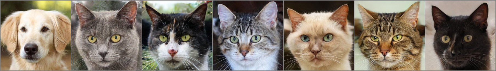
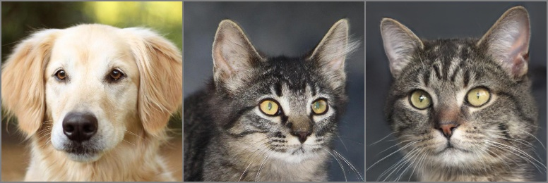
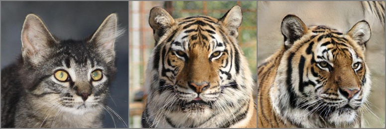
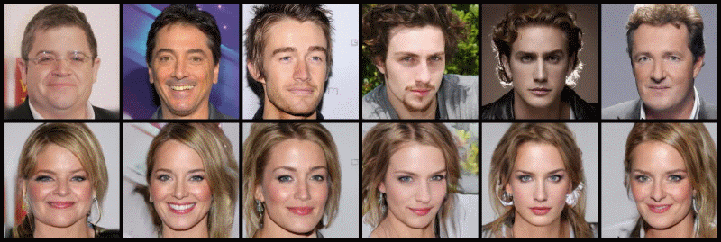

# GP-UNIT - Official PyTorch Implementation


This repository provides the official PyTorch implementation for the following paper:

**Unsupervised Image-to-Image Translation with Generative Prior**<br>
[Shuai Yang](https://williamyang1991.github.io/), [Liming Jiang](https://liming-jiang.com/), [Ziwei Liu](https://liuziwei7.github.io/) and [Chen Change Loy](https://www.mmlab-ntu.com/person/ccloy/)<br>
In CVPR 2022.<br>
[**Project Page**](https://www.mmlab-ntu.com/project/gpunit/) | [**Paper**](https://arxiv.org/abs/2204.03641) | [**Supplementary Video**](https://www.youtube.com/watch?v=dDApWs_oDrM)
> **Abstract:** *Unsupervised image-to-image translation aims to learn the translation between two visual domains without paired data. Despite the recent progress in image translation models, it remains challenging to build mappings between complex domains with drastic visual discrepancies. In this work, we present a novel framework, Generative Prior-guided UNsupervised Image-to-image Translation (GP-UNIT), to improve the overall quality and applicability of the translation algorithm. Our key insight is to leverage the generative prior from pre-trained class-conditional GANs (e.g., BigGAN) to learn rich content correspondences across various domains. We propose a novel coarse-to-fine scheme: we first distill the generative prior to capture a robust coarse-level content representation that can link objects at an abstract semantic level, based on which fine-level content features are adaptively learned for more accurate multi-level content correspondences. Extensive experiments demonstrate the superiority of our versatile framework over state-of-the-art methods in robust, high-quality and diversified translations, even for challenging and distant domains.*


## Updates

- [04/2022] Paper and supplementary video are released.
- [04/2022] Code and dataset are released.
- [03/2022] This website is created.

## Installation
**Clone this repo:**
```bash
git clone https://github.com/williamyang1991/GP-UNIT.git
cd GP-UNIT
```
**Dependencies:**

We have tested on:
- CUDA 10.1
- PyTorch 1.7.0
- Pillow 8.0.1; Matplotlib 3.3.3; opencv-python 4.4.0; Faiss 1.7.0; tqdm 4.54.0

All dependencies for defining the environment are provided in `environment/gpunit_env.yaml`.
We recommend running this repository using [Anaconda](https://docs.anaconda.com/anaconda/install/):
```bash
conda env create -f ./environment/gpunit_env.yaml
```
We use CUDA 10.1 so it will install PyTorch 1.7.0 (corresponding to [Line 16](./environment/gpunit_env.yaml#L16), [Line 113](./environment/gpunit_env.yaml#L113), [Line 120](./environment/gpunit_env.yaml#L120), [Line 121](./environment/gpunit_env.yaml#L121) of `gpunit_env.yaml`). Please install PyTorch that matches your own CUDA version following [https://pytorch.org/](https://pytorch.org/).

<br/>

## (1) Dataset Preparation

Human face dataset, animal face dataset and aristic human face dataset can be downloaded from their official pages.
Bird, dog and car datasets can be built from ImageNet with our provided [script](./data_preparation).

| Task | Used Dataset | 
| :--- | :--- | 
| Male←→Female | [CelebA-HQ](https://github.com/clovaai/stargan-v2#datasets-and-pre-trained-networks): divided into male and female subsets by [StarGANv2](https://github.com/clovaai/stargan-v2#datasets-and-pre-trained-networks) |
| Dog←→Cat←→Wild| [AFHQ](https://github.com/clovaai/stargan-v2#datasets-and-pre-trained-networks) provided by [StarGANv2](https://github.com/clovaai/stargan-v2#datasets-and-pre-trained-networks) |
| Face←→Cat or Dog| [CelebA-HQ](https://github.com/switchablenorms/CelebAMask-HQ) and [AFHQ](https://github.com/clovaai/stargan-v2#datasets-and-pre-trained-networks) |
| Bird←→Dog | 4 classes of birds and 4 classes of dogs in ImageNet291. Please refer to [dataset preparation](./data_preparation#2-imagenet291) for building ImageNet291 from [ImageNet](https://image-net.org/download.php) |
| Bird←→Car | 4 classes of birds and 4 classes of cars in ImageNet291. Please refer to [dataset preparation](./data_preparation#2-imagenet291) for building ImageNet291 from [ImageNet](https://image-net.org/download.php) |
| Face→MetFace |  [CelebA-HQ](https://github.com/switchablenorms/CelebAMask-HQ) and [MetFaces](https://github.com/NVlabs/metfaces-dataset) |

<br/>

## (2) Inference for Latent-Guided and Exemplar-Guided Translation

### Inference Notebook 
<a href="http://colab.research.google.com/github/williamyang1991/GP-UNIT/blob/master/notebooks/inference_playground.ipynb"></a>  
To help users get started, we provide a Jupyter notebook at `./notebooks/inference_playground.ipynb` that allows one to visualize the performance of GP-UNIT.
The notebook will download the necessary pretrained models and run inference on the images in `./data/`.


### Web Demo 
Try Replicate web demo here [](https://replicate.com/williamyang1991/gp-unit)

### Pretrained Models

Pretrained models can be downloaded from [Google Drive](https://drive.google.com/drive/folders/1GMGCPt1xfh0Zs82lfkQLifMZR27yANTI?usp=sharing) or [Baidu Cloud](https://pan.baidu.com/s/1GlCnwd_0EDHNTsQrvM0xhA?pwd=cvpr) (access code: cvpr):

| Task | Pretrained Models | 
| :--- | :--- | 
| Prior Distillation | [content encoder](https://drive.google.com/file/d/1I7_IMMheihcIR57vInof5g6R0j8wEonx/view?usp=sharing) |
| Male←→Female | generators for [male2female](https://drive.google.com/file/d/1I0xqtbuuPOhcteHH613PGX7uO3fMTf9r/view?usp=sharing) and [female2male](https://drive.google.com/file/d/19xIY0vqHVpah4UyXKgz7trWi1TdlPD_T/view?usp=sharing) |
| Dog←→Cat←→Wild| generators for [dog2cat](https://drive.google.com/file/d/1PJyk0hKClceTHRD6BORFVEpG-pl0lPFm/view?usp=sharing), [cat2dog](https://drive.google.com/file/d/1EvQRKY4AN1JxAElsOPkuqqSRZVCNL3gA/view?usp=sharing), [dog2wild](https://drive.google.com/file/d/11j0kG1EJoSLWX6AJ8kaIWp_QFAZoUdpI/view?usp=sharing), [wild2dog](https://drive.google.com/file/d/16lr7bce4qGEmUWlfKZuRatyX_OsKdNkg/view?usp=sharing), [cat2wild](https://drive.google.com/file/d/16sBFFxbc1zX2LfruMUuY7aVZekng032g/view?usp=sharing) and [wild2cat](https://drive.google.com/file/d/1LVNfpBdHPNog1_tk9rE5x_4oQUUV8uEy/view?usp=sharing) |
| Face←→Cat or Dog| generators for [face2cat](https://drive.google.com/file/d/1CKKXDaD0h6i1RFtbcHOL8Bj3P37_Cheh/view?usp=sharing), [cat2face](https://drive.google.com/file/d/1cAYIYU6JUunBRhw94cssp8cPnuD7hJgo/view?usp=sharing), [dog2face](https://drive.google.com/file/d/1OPINn14b_rwKdEO1l_2ON__ngBLSllPq/view?usp=sharing) and [face2dog](https://drive.google.com/file/d/1_RrsNvaswMuLqrUr79q8HBx9TcP_zS9y/view?usp=sharing) |
| Bird←→Dog | generators for [bird2dog](https://drive.google.com/file/d/1Nm0jAI6dxDLBUdIFPEx8qU002IUdBaTO/view?usp=sharing) and [dog2bird](https://drive.google.com/file/d/1Ud_IJTO8Ovi7T7lsMG3S9boYASemnVAB/view?usp=sharing) |
| Bird←→Car | generators for [bird2car](https://drive.google.com/file/d/1PR_AF8JnYMaXH3hKipGxUZEjgrUu_0r5/view?usp=sharing) and [car2bird](https://drive.google.com/file/d/1j1N6vMNhPt4beLDrwP-uBd-jgPoQqg4O/view?usp=sharing) |
| Face→MetFace | generator for [face2metface](https://drive.google.com/file/d/15IoEyUUY-1vnfqqVquVYMCleHVXt4jJs/view?usp=sharing) |

The saved checkpoints are under the following folder structure:
```
checkpoint
|--content_encoder.pt     % Content encoder
|--bird2car.pt            % Bird-to-Car translation model
|--bird2dog.pt            % Bird-to-Dog translation model
...
```

### Latent-Guided Translation
Translate a content image to the target domain with randomly sampled latent styles:
```python
python inference.py --generator_path PRETRAINED_GENERATOR_PATH --content_encoder_path PRETRAINED_ENCODER_PATH \ 
                    --content CONTENT_IMAGE_PATH --batch STYLE_NUMBER --device DEVICE
```
By default, the script will use `.\checkpoint\dog2cat.pt` as PRETRAINED_GENERATOR_PATH, `.\checkpoint\content_encoder.pt` as PRETRAINED_ENCODER_PATH, and
`cuda` as DEVICE for using GPU. For running on CPUs, use `--device cpu`.

Take Dog→Cat as an example, run:
> python inference.py --content ./data/afhq/images512x512/test/dog/flickr_dog_000572.jpg --batch 6

Six results `translation_flickr_dog_000572_N.jpg` (N=0~5) are saved in the folder `.\output\`.
An corresponding overview image `translation_flickr_dog_000572_overview.jpg` is additionally saved to illustrate the input content image and the six results: 



**Evaluation Metrics**: We use the [code of StarGANv2](https://github.com/clovaai/stargan-v2/blob/master/metrics/eval.py#L26) to calculate FID and Diversity with LPIPS in our paper.

### Exemplar-Guided Translation
Translate a content image to the target domain in the style of a style image by additionally specifying `--style`:
```python
python inference.py --generator_path PRETRAINED_GENERATOR_PATH --content_encoder_path PRETRAINED_ENCODER_PATH \ 
                    --content CONTENT_IMAGE_PATH --style STYLE_IMAGE_PATH --device DEVICE
```

Take Dog→Cat as an example, run:
> python inference.py --content ./data/afhq/images512x512/test/dog/flickr_dog_000572.jpg --style ./data/afhq/images512x512/test/cat/flickr_cat_000418.jpg 

The result `translation_flickr_dog_000572_to_flickr_cat_000418.jpg` is saved in the folder `.\output\`.
An corresponding overview image `translation_flickr_dog_000572_to_flickr_cat_000418_overview.jpg` is additionally saved to illustrate the input content image, the style image, and the result: 



Another example of Cat→Wild, run:
> python inference.py --generator_path ./checkpoint/cat2wild.pt --content ./data/afhq/images512x512/test/cat/flickr_cat_000418.jpg --style ./data/afhq/images512x512/test/wild/flickr_wild_001112.jpg

The overview image is as follows: 



<br/>

## (3) Training GP-UNIT

Download the supporting models to the `./checkpoint/` folder:

| Model | Description |
| :--- | :--- |
| [content_encoder.pt](https://drive.google.com/file/d/1I7_IMMheihcIR57vInof5g6R0j8wEonx/view?usp=sharing) | Our pretrained content encoder which distills BigGAN prior from the [synImageNet291](https://drive.google.com/file/d/1amMu_IU_W0ELGq7x2ixAMk5ZJlBUNCqL/view?usp=sharing) dataset. |
| [model_ir_se50.pth](https://drive.google.com/file/d/1KW7bjndL3QG3sxBbZxreGHigcCCpsDgn/view?usp=sharing) | Pretrained IR-SE50 model taken from [TreB1eN](https://github.com/TreB1eN/InsightFace_Pytorch) for ID loss. |


### Train Image-to-Image Transaltion Network
```python
python train.py --task TASK --batch BATCH_SIZE --iter ITERATIONS \
                --source_paths SPATH1 SPATH2 ... SPATHS --source_num SNUM1 SNUM2 ... SNUMS \
                --target_paths TPATH1 TPATH2 ... TPATHT --target_num TNUM1 TNUM2 ... TNUMT
```
where `SPATH1`~`SPATHS` are paths to `S` folders containing images from the source domain (*e.g.*, `S` classes of ImageNet birds),
`SNUMi` is the number of images in `SPATHi` used for training. 
`TPATHi`, `TNUMi` are similarily defined but for the target domain. 
By default, `BATCH_SIZE=16` and `ITERATIONS=75000`.
If `--source_num`/`--target_num` is not specified, all images in the folders are used.

The trained model is saved as `./checkpoint/TASK-ITERATIONS.pt`. Intermediate results are saved in `./log/TASK/`.

This training does not necessarily lead to the optimal results, which can be further customized with additional command line options:
- `--style_layer` (default: 4): the discriminator layer to compute the feature matching loss. We found setting `style_layer=5` gives better performance on human faces.
- `--use_allskip` (default: False): whether using dynamic skip connections to compute the reconstruction loss. For tasks involving close domains like gender translation, season transfer and face stylization, using `use_allskip` gives better results.
- `--use_idloss` (default: False): whether using the identity loss. For Cat/Dog→Face and Face→MetFace tasks, we use this loss.
- `--not_flip_style` (default: False): whether not randomly flipping the style image when extracting the style feature. Random flipping prevents the network to learn  position information from the style image. 
- `--mitigate_style_bias`(default: False): whether resampling style features when training the sampling network. For imbalanced dataset that has minor groups, `mitigate_style_bias` oversamples those style features that are far from the mean style feature of the whole dataset. This leads to more diversified latent-guided translation at the cost of  slight image quality degradation. We use it on CelebA-HQ and AFHQ-related tasks.

Here are some examples:  
(Parts of our tasks require the ImageNet291 dataset. Please refer to [data preparation](./data_preparation))

**Male→Female**
>python train.py --task male2female --source_paths ./data/celeba_hq/train/male
                 --target_paths ./data/celeba_hq/train/female
                 --style_layer 5 --mitigate_style_bias --use_allskip --not_flip_style

**Cat→Dog**
> python train.py --task cat2dog --source_paths ./data/afhq/images512x512/train/cat --source_num 4000 --target_paths ./data/afhq/images512x512/train/dog --target_num 4000 --mitigate_style_bias

**Cat→Face**
>python train.py --task cat2face --source_paths ./data/afhq/images512x512/train/cat --source_num 4000
                 --target_paths ./data/ImageNet291/train/1001_face/ 
                 --style_layer 5 --mitigate_style_bias --not_flip_style --use_idloss

**Bird→Car** (translating 4 classes of birds to 4 classes of cars)
> python train.py --task bird2car --source_paths ./data/ImageNet291/train/10_bird/ 
>                 ./data/ImageNet291/train/11_bird/ ./data/ImageNet291/train/12_bird/ 
>                 ./data/ImageNet291/train/13_bird/ --source_num 600 600 600 600
>                 --target_paths ./data/ImageNet291/train/436_vehicle/
>                 ./data/ImageNet291/train/511_vehicle/ ./data/ImageNet291/train/627_vehicle/
>                 ./data/ImageNet291/train/656_vehicle/ --target_num 600 600 600 600 


### Train Content Encoder of Prior Distillation

We provide our pretrained model [content_encoder.pt](https://drive.google.com/file/d/1I7_IMMheihcIR57vInof5g6R0j8wEonx/view?usp=sharing) at [Google Drive](https://drive.google.com/drive/folders/1GMGCPt1xfh0Zs82lfkQLifMZR27yANTI?usp=sharing) or [Baidu Cloud](https://pan.baidu.com/s/1GlCnwd_0EDHNTsQrvM0xhA?pwd=cvpr) (access code: cvpr). This model is obtained by:
> python prior_distillation.py --unpaired_data_root ./data/ImageNet291/train/ 
                              --paired_data_root ./data/synImageNet291/train/ 
                              --unpaired_mask_root ./data/ImageNet291_mask/train/ 
                              --paired_mask_root ./data/synImageNet291_mask/train/

The training requires ImageNet291 and synImageNet291 datasets. Please refer to [data preparation](./data_preparation).

<br/>

## Results

#### Male-to-Female: close domains



#### Cat-to-Dog: related domains 


#### Dog-to-Human and Bird-to-Dog: distant domains  


#### Bird-to-Car: extremely distant domains for stress testing


## Citation

If you find this work useful for your research, please consider citing our paper:

```bibtex
@inproceedings{yang2022Unsupervised,
  title={Unsupervised Image-to-Image Translation with Generative Prior},
  author={Yang, Shuai and Jiang, Liming and Liu, Ziwei and Loy, Chen Change},
  booktitle={CVPR},
  year={2022}
}
```

## Acknowledgments

The code is developed based on [StarGAN v2](https://github.com/clovaai/stargan-v2), [SPADE](https://github.com/NVlabs/SPADE) and [Imaginaire](https://github.com/nvlabs/imaginaire).
